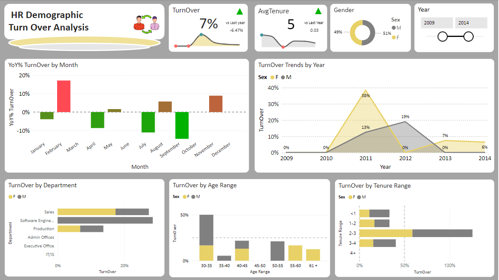
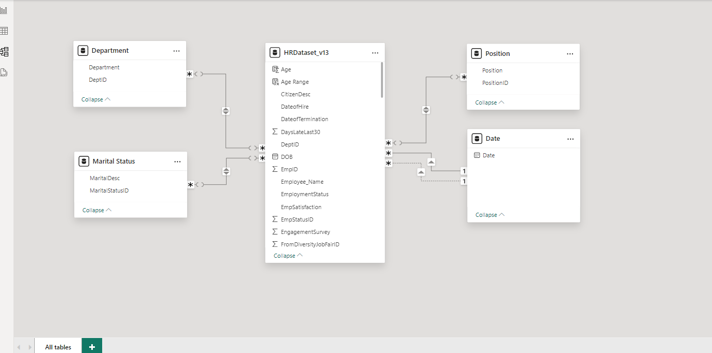
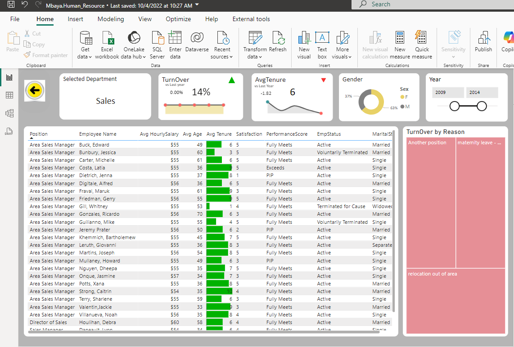

# Power-BI-Project

This is a Power BI dashboard that provides an overview of HR Demographic Turnover Analysis. The dashboard features various visualizations, including bar charts, line charts, and pie charts, showing metrics like turnover by department, gender, tenure, and age. Key performance indicators (KPIs) such
## Problem Statement :
Objective: The HR Demographic Turnover Analysis dashboard provides comprehensive insights into employee turnover across multiple demographic and organizational dimensions, including department, tenure, age, and gender. By visualizing turnover trends and key performance indicators (KPIs) like average tenure and turnover percentage, the dashboard helps HR leaders understand where turnover is highest and determine which groups are most affected. This allows for data-driven decisions aimed at improving employee retention, reducing costs, and fostering a more engaged workforce.
## Skills / Concepts demonstrated :
Power BI Modelling, DAX, KPI, Drill through , Drill down, Page navigation , data visualization and story telling
#### Power BI Model - Simple STAR Schema 
                          
#### Drill through Page

##### Conclusion 
March is a critical month for employee exits, with turnover peaking compared to other months. 2011 experienced a significant turnover event, especially for female employees, but this was followed by a sharp decline in subsequent years.
Sales and IT/IS departments are most affected by turnover, which may suggest the need for targeted retention strategies in these areas. Employees in the 30-35 age range and those with 2-3 years of tenure are most likely to leave, which could signal that employees are reconsidering their long-term fit within the organization during this phase. Retention efforts should focus on mid-tenure employees (2-3 years) and the Sales department, as they represent the highest turnover segments.
### Interact with the report [here](https://app.powerbi.com/your-report-url).
